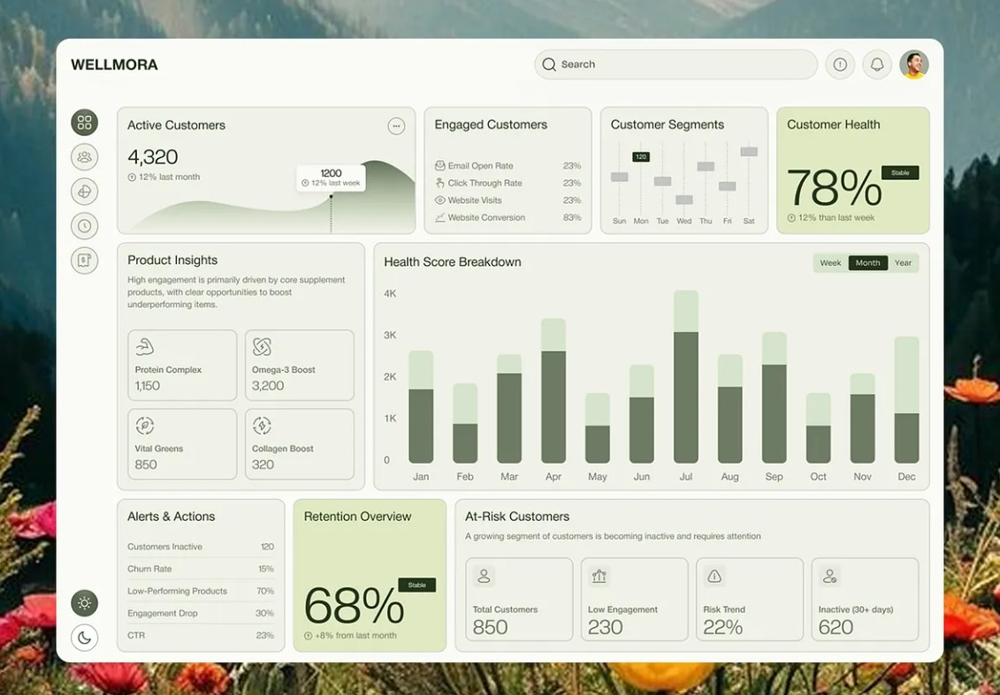

# INSYTE — Finalized Project Architecture & Approach

This document outlines the finalized strategy, architecture, and design for the **INSYTE — E-Commerce Customer Behaviour Analytics** platform.

---

## 1. Dataset Strategy: Amazon Reviews 2023

To ensure high-quality review data and authentic media, we will utilize the [Amazon Reviews 2023 Dataset](https://amazon-reviews-2023.github.io/).

*   **Multi-Category Sampling**: Instead of restricting the platform to a single product category, we will sample a percentage of data across several diverse categories. This ensures a rich, realistic e-commerce product catalog.
*   **Authentic Attributes**: We gain real 1-5 star ratings, genuine customer review text, and real product image URLs out of the box.
*   **Synthesizing Transactions**: Because the Amazon dataset is primarily review-focused and lacks traditional `InvoiceNo`, `Quantity`, and `InvoiceDate` structures, our ETL pipeline will synthesize realistic transactional order data (invoices, quantities, prices) anchored to the review timestamps and user IDs. This guarantees we can execute advanced RFM and Cohort retention analytics accurately.

---

## 2. UI / UX Design System

The dashboard will be strictly modeled after the provided wireframe inspiration, adapting its aesthetic into a premium E-Commerce Analytics tool.

<b>Click to view UI Inspiration Wireframe</b>

 

**Design Language & Inspiration:**
*   **Theme**: The provided wireframe's color palette featuring soft greens, muted neutrals, and clean, high-contrast text.
*   **Components**: Minimalist, rounded cards with soft shadows to separate KPI metrics clearly.
*   **Layout**: A persistent left sidebar with icons and labels, a top header for global search and filters, and a highly readable, dense content area for charts and tables.
*   **Adaptation**: While the visual style mimics the provided wireframe, the terminology and metrics will strictly reflect E-Commerce data (e.g., Revenue, RFM Segments, Return Rates) rather than health/wellness metrics.

---

## 3. Hybrid Deployment Architecture: ORDS + Vercel Serverless

To achieve the best of both worlds—**zero maintenance and blazing fast performance, while still supporting advanced AI/Python requirements**—we will implement a Hybrid Architecture. 

This directly addresses the strengths of both platforms:

### A. Oracle ORDS (The Primary Data Layer)
Oracle REST Data Services (ORDS) will handle the vast majority of the application's read-heavy analytical dashboards.
*   **Used For**: Overview KPIs, RFM Segmentation, Cohort Retention Matrices, Product Analytics, Sales Trends, and Review Distributions.
*   **Why**: Zero cold starts. The frontend (hosted statically on Vercel) makes standard `fetch()` requests directly to Oracle Cloud over HTTPS. It is incredibly fast and consumes zero Vercel compute hours.

### B. Vercel Python Serverless (The Specialized Compute Layer)
Vercel Serverless Functions (`/api/*` in Python) will be used *only* when Python's ecosystem or dynamic query execution is strictly required.
*   **Used For**:
    1.  **AI Vector Search**: The Lambda receives the user's search text, uses a Python library (e.g., `sentence-transformers`) to generate the 384-dimensional embedding, and passes that vector to Oracle for `VECTOR_DISTANCE` matching.
    2.  **SQL Insights (EXPLAIN PLAN)**: The Lambda dynamically executes `EXPLAIN PLAN FOR ...` and formats the database optimization tree to demonstrate academic query performance.
    3.  **Media Uploads**: If a consumer uploads a new image review, the Lambda handles receiving the file securely and uploading it to a cloud CDN.
*   **Why**: Offloads the heavy Python requirements to serverless without bottlenecking the main dashboard's load time.

---

## 4. The 7 Application Modules

The application will strictly follow this structure:
1.  **Overview**: Revenue, Orders, KPIs, SQL Insights.
2.  **Customer Analytics**: RFM Segmentation (`NTILE(5)`), Spending Distribution.
3.  **Product Analytics**: Top Products, Price Elasticity, JSON Metadata.
4.  **Sales & Trends**: Cohort Retention Matrix (`MONTHS_BETWEEN`), Geographic splits.
5.  **Reviews & Media**: Sentiment, Rating Distribution, Authentic Media Gallery.
6.  **Product Health**: Health Matrix (Revenue vs. Sentiment).
7.  **SQL Insights**: The academic evaluation tab exposing underlying queries, parameters, and execution times (powered by Vercel Serverless).

---

## 5. Next Steps

1.  **Data Ingestion Pipeline**: Develop the Python ETL scripts to sample the Amazon dataset across categories, synthesize the transactional records, and import them into the Oracle Autonomous Database.
2.  **Database Configuration**: Enable ORDS on the analytical views for lightning-fast frontend access.
3.  **Vercel Configuration**: Setup the static frontend deployment and configure the specialized `/api/` Python Lambdas for Vector Search and SQL Insights.
