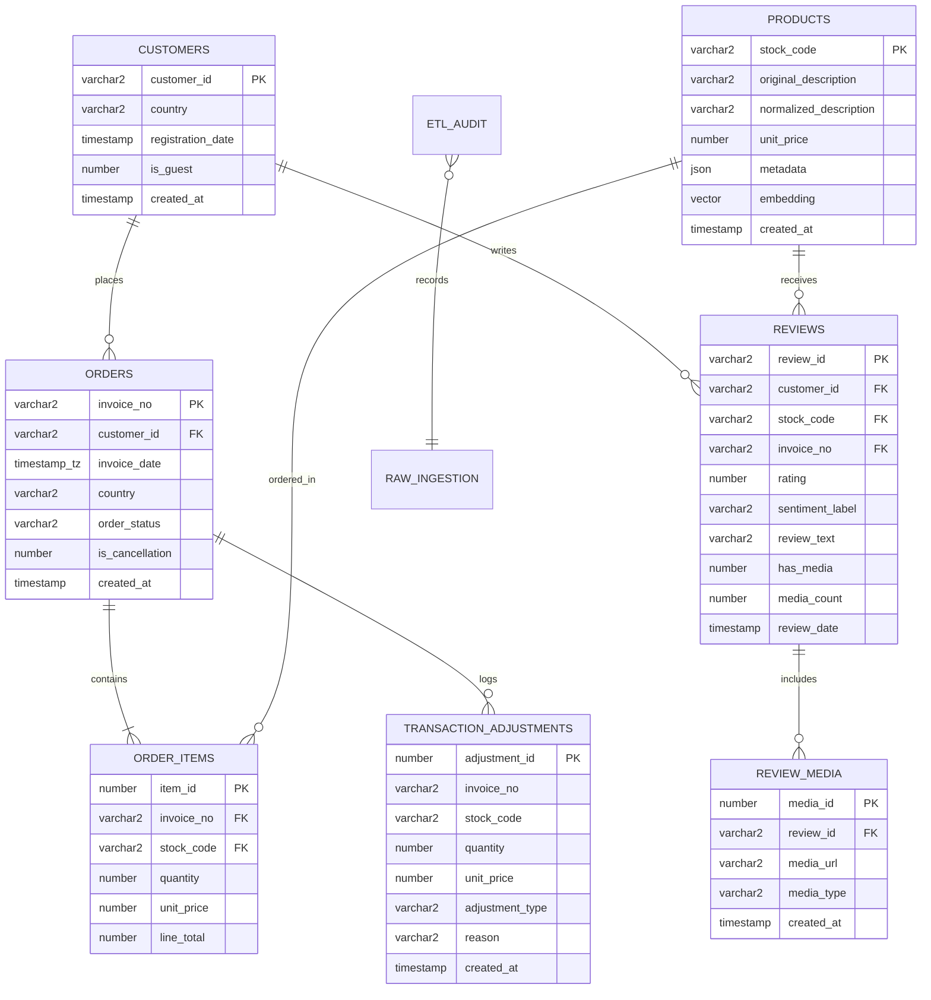

# INSYTE — E-Commerce Customer Behaviour Analytics
## Master Architecture, Database Specification & Project Roadmap

---

## 1. Executive Summary & Academic Objectives

**INSYTE** is an enterprise-grade, database-centric customer intelligence and e-commerce behavioral analytics platform. Built around transactional retail datasets (modeled after the UCI Online Retail / Online Retail II repository) and enriched with optional customer text reviews and media assets, INSYTE eliminates external machine learning bloat by executing all behavioral clustering, cohort retention modeling, revenue segmentation, and semantic vector similarity natively inside **Oracle Database 23ai Free**.

### Key Academic Demonstration Pillars
- **Database-Centric Computation:** Complex aggregations, window functions, cohort matrices, and customer classifications occur in Oracle SQL engine, not Python memory.
- **Modern Oracle 23ai Innovations:** Native vector embeddings (`VECTOR(384, FLOAT32)`), dot-notation JSON search, Materialized Views, and globalization with timezone offsets.
- **Enterprise Security & Governance:** Separation of concerns using Oracle Data Control Language (DCL) between `INSYTE_ADMIN` (schema owner/ETL) and `INSYTE_ANALYST` (least-privilege read-only reporting).
- **Academic Transparency & SQL Visibility:** Dedicated in-app **SQL Insights** viewer exposing exact query syntax, bind parameters, data dictionary introspection (`USER_*` views), and execution plans (`EXPLAIN PLAN`).
- **Complete Portability:** Zero-code difference between local Docker development and DigitalOcean Droplet production through decoupled environment configuration.
- **Strict Data Integrity:** Absolutely no fabricated reviews, ratings, media, or metrics. Dynamic mapping layers and clear "Data not available" states when optional fields are absent.

---

## 2. Dataset Context & Dynamic Schema Mapping Layer

The system supports standard e-commerce transactional schemas with dynamic adaptation for optional review and media columns.

### Canonical Mapping Architecture

```
Raw Imported Dataset (CSV / Excel / Parquet)
                    │
                    ▼
       ┌──────────────────────────┐
       │ Schema Inspection Engine │
       └────────────┬─────────────┘
                    ▼
       ┌──────────────────────────┐
       │  Dynamic Column Mapping  │
       └────────────┬─────────────┘
                    ▼
   ┌────────────────────────────────┐
   │ Validated Canonical Entities   │
   ├────────────────────────────────┤
   │ • Transactions (Orders/Items)  │
   │ • Customers (Known vs Guest)   │
   │ • Products (JSON + Vectors)    │
   │ • Reviews (Sentiment/Ratings)  │
   │ • Review Media (Images/Videos) │
   │ • ETL Audit & Adjustments      │
   └────────────────────────────────┘
```

### Transactional Fields Mapping

| Source Raw Variations | Canonical Target | Target Table | Type / Constraints | Transformation Logic |
| :--- | :--- | :--- | :--- | :--- |
| `Invoice`, `InvoiceNo`, `invoice_id` | `invoice_no` | `ORDERS`, `ORDER_ITEMS` | `VARCHAR2(20)` | Trim whitespace; detect cancellation prefixes (`C%`). |
| `StockCode`, `ProductCode`, `sku` | `stock_code` | `PRODUCTS`, `ORDER_ITEMS`| `VARCHAR2(20)` | Uppercase, trim whitespace. |
| `Description`, `ProductName`, `title` | `description` | `PRODUCTS` | `VARCHAR2(500)` | Retain raw description; generate normalized string via regex. |
| `Quantity`, `Qty`, `count` | `quantity` | `ORDER_ITEMS` | `NUMBER(10)` | Positive values to sales; negative values to `TRANSACTION_ADJUSTMENTS`. |
| `InvoiceDate`, `OrderDate`, `timestamp`| `invoice_date` | `ORDERS` | `TIMESTAMP WITH TIME ZONE` | Parse to standard ISO/Oracle timestamp with explicit timezone. |
| `Price`, `UnitPrice`, `item_price` | `unit_price` | `ORDER_ITEMS`, `PRODUCTS` | `NUMBER(10, 2)` | Validate `> 0`. Transactional price stored permanently in `ORDER_ITEMS`. |
| `Customer ID`, `CustomerID`, `user_id`| `customer_id` | `CUSTOMERS`, `ORDERS` | `VARCHAR2(30)` | Nullable. If NULL, flag order as guest transaction (`is_guest = 1`). |
| `Country`, `CountryName` | `country` | `CUSTOMERS`, `ORDERS` | `VARCHAR2(100)` | Country normalization; retained on order level to track cross-border trends. |

### Dynamic Review & Media Mapping Layer

| Canonical Target | Acceptable Raw Input Variations | Fallback Rule if Not Present |
| :--- | :--- | :--- |
| `review_text` | `Review Text`, `review_text`, `comment`, `feedback`, `review` | Show `"No review text provided"` |
| `rating` | `Rating`, `Review Rating`, `stars`, `score`, `review_score` | Do not fabricate rating; derive from text sentiment or mark N/A |
| `review_date` | `Review Date`, `review_date`, `created_at`, `timestamp` | Default to order timestamp or ingestion timestamp |
| `media_url` | `Media URL`, `Image URL`, `Photo URL`, `Video URL`, `media` | Mark `has_media = 0` |
| `media_type` | `Media Type`, `Content Type`, `mime_type` | Detect extension (`.jpg`, `.png`, `.mp4`) or label `UNKNOWN` |
| `has_media` | `Has Media`, `Media Available`, `is_media` | Derived boolean: `CASE WHEN media_url IS NOT NULL THEN 1 ELSE 0 END` |

> [!IMPORTANT]
> **Strict Non-Fabrication Rule**: If review or media columns do not exist in the source dataset, the UI dynamically displays informative empty-state banners (*"Review data is not available in the current dataset"*). Synthetic records are never fabricated.

---

## 3. Core Database-Centric Principle & Architecture

```
┌────────────────────────────────────────────────────────┐
│                   Web Browser Client                   │
│        (Responsive Dashboard, ECharts, Vanilla JS)     │
└───────────────────────────▲────────────────────────────┘
                            │ HTTP / JSON
┌───────────────────────────▼────────────────────────────┐
│                    Flask API Layer                     │
│    • Route orchestration       • SentenceTransformers  │
│    • Parameter validation      • Connection Pool       │
└───────────────────────────▲────────────────────────────┘
                            │ python-oracledb (Thin Mode)
┌───────────────────────────▼────────────────────────────┐
│              Oracle Database 23ai Free                 │
│                                                        │
│  ┌────────────────────────┐  ┌──────────────────────┐  │
│  │   INSYTE_ADMIN (DDL)   │  │ INSYTE_ANALYST (RO)  │  │
│  │   • Master Schema      │  │ • Restricted Role    │  │
│  │   • Sequences & MVs    │  │ • Read-Only Views    │  │
│  └────────────────────────┘  └──────────────────────┘  │
│                                                        │
│  ┌──────────────────────────────────────────────────┐  │
│  │ In-Database Compute Engine (SQL Analytics)       │  │
│  │ • NTILE(5) RFM Segmentation                      │  │
│  │ • Cohort Retention (MIN() OVER & MONTHS_BETWEEN) │  │
│  │ • Materialized Views & Refresh Procedures        │  │
│  │ • Native VECTOR_DISTANCE (HNSW Cosine Search)    │  │
│  │ • Native JSON Dot-Notation & JSON_VALUE Queries  │  │
│  │ • Execution Plan Generation (EXPLAIN PLAN)       │  │
│  └──────────────────────────────────────────────────┘  │
│                                                        │
│  ┌──────────────────────────────────────────────────┐  │
│  │ Storage Engine: ./oradata (Host Volume Mount)    │  │
│  └──────────────────────────────────────────────────┘  │
└────────────────────────────────────────────────────────┘
```

### Division of Responsibilities
- **Oracle Database 23ai:** Executes all filtering, joins, aggregations, window ranking, cohort partitioning, RFM scoring, text regex sanitization, vector similarity indexing, and execution-plan caching.
- **Python / Flask Backend:** Operates as a lightweight proxy service. Converts incoming REST parameters to bind variables, manages connection pooling via `oracledb.create_pool()`, generates 384-d vectors from search input, and streams JSON responses.
- **Frontend Layer:** Renders interactive data-dense charts, RFM heatmaps, and SQL inspection tabs using client-side JavaScript.

---

## 4. Containerization & Portability Strategy

To satisfy academic deployment standards and enable 1-click migration between local environments and cloud droplets (DigitalOcean):

### 1. Docker Compose Specification (`docker-compose.yml`)
```yaml
version: '3.8'

services:
  oracle-db:
    image: container-registry.oracle.com/database/free:latest
    container_name: oracle-23ai-insyte
    ports:
      - "${DB_PORT:-1521}:1521"
    environment:
      - ORACLE_PASSWORD=${DB_PASSWORD}
    volumes:
      - ./oradata:/opt/oracle/oradata
    restart: always
```

### 2. Environment Configuration (`.env`)
```bash
# ================================================================
# Database Connection Decoupling
# Localhost: DB_HOST=localhost
# DigitalOcean: DB_HOST=<DROPLET_PUBLIC_IP> or docker service name
# ================================================================
DB_HOST=localhost
DB_PORT=1521
DB_SERVICE=FREEPDB1

# Oracle Privileged Accounts
DB_SYS_USER=SYS
DB_PASSWORD=InsyteOracle23ai#Secure2026

# Application Roles
APP_ADMIN_USER=INSYTE_ADMIN
APP_ADMIN_PASSWORD=AdminSecurePassword2026!
APP_ANALYST_USER=INSYTE_ANALYST
APP_ANALYST_PASSWORD=AnalystSecurePassword2026!

# Application Server
FLASK_ENV=development
FLASK_PORT=5000
FLASK_DEBUG=1
SECRET_KEY=insyte_ecommerce_behavioral_secret_key_2026
```

### 3. Volume Persistence
- Mounting `./oradata:/opt/oracle/oradata` guarantees all transactional data, tablespaces, vector indexes, and materialized view caches remain persistent across container restarts or host reboots.

---

## 5. Security Architecture & Oracle DCL

We enforce strict least-privilege security by partitioning the application into two dedicated schemas:

```sql
-- Connect as SYSDBA to FREEPDB1
ALTER SESSION SET CONTAINER = FREEPDB1;

-- 1. Administrative Owner Role
CREATE USER INSYTE_ADMIN IDENTIFIED BY "AdminSecurePassword2026!"
  DEFAULT TABLESPACE USERS
  QUOTA UNLIMITED ON USERS;

GRANT CREATE SESSION, CREATE TABLE, CREATE VIEW, CREATE MATERIALIZED VIEW,
      CREATE SEQUENCE, CREATE SYNONYM, CREATE PROCEDURE, CREATE TRIGGER TO INSYTE_ADMIN;

-- 2. Read-Only Analyst Role (Least Privilege)
CREATE ROLE INSYTE_ANALYST_ROLE;
CREATE USER INSYTE_ANALYST IDENTIFIED BY "AnalystSecurePassword2026!";
GRANT CREATE SESSION TO INSYTE_ANALYST;
GRANT INSYTE_ANALYST_ROLE TO INSYTE_ANALYST;

-- Grant selective read access on analytical views and tables
GRANT SELECT ON INSYTE_ADMIN.CUSTOMERS TO INSYTE_ANALYST_ROLE;
GRANT SELECT ON INSYTE_ADMIN.PRODUCTS TO INSYTE_ANALYST_ROLE;
GRANT SELECT ON INSYTE_ADMIN.ORDERS TO INSYTE_ANALYST_ROLE;
GRANT SELECT ON INSYTE_ADMIN.ORDER_ITEMS TO INSYTE_ANALYST_ROLE;
GRANT SELECT ON INSYTE_ADMIN.REVIEWS TO INSYTE_ANALYST_ROLE;
GRANT SELECT ON INSYTE_ADMIN.REVIEW_MEDIA TO INSYTE_ANALYST_ROLE;
GRANT SELECT ON INSYTE_ADMIN.MV_CUSTOMER_RFM_SUMMARY TO INSYTE_ANALYST_ROLE;
GRANT SELECT ON INSYTE_ADMIN.MV_MONTHLY_REVENUE_TRENDS TO INSYTE_ANALYST_ROLE;
```

---

## 6. Relational & Physical Database Schema

### Entity-Relationship Diagram (ERD)



### Table Definitions

#### 1. `CUSTOMERS`
- `customer_id` VARCHAR2(30) PRIMARY KEY (Non-null known customer IDs)
- `country` VARCHAR2(100)
- `registration_date` TIMESTAMP WITH TIME ZONE
- `is_guest` NUMBER(1) DEFAULT 0
- `created_at` TIMESTAMP DEFAULT CURRENT_TIMESTAMP

#### 2. `PRODUCTS`
- `stock_code` VARCHAR2(20) PRIMARY KEY
- `original_description` VARCHAR2(500)
- `normalized_description` VARCHAR2(500)
- `unit_price` NUMBER(10, 2)
- `metadata` JSON (Oracle 23ai native binary JSON type)
- `embedding` VECTOR(384, FLOAT32) (Native vector column)
- `created_at` TIMESTAMP DEFAULT CURRENT_TIMESTAMP

#### 3. `ORDERS`
- `invoice_no` VARCHAR2(20) PRIMARY KEY
- `customer_id` VARCHAR2(30) REFERENCES CUSTOMERS(customer_id) ON DELETE SET NULL
- `invoice_date` TIMESTAMP WITH TIME ZONE NOT NULL
- `country` VARCHAR2(100)
- `order_status` VARCHAR2(20) DEFAULT 'COMPLETED'
- `is_cancellation` NUMBER(1) DEFAULT 0
- `created_at` TIMESTAMP DEFAULT CURRENT_TIMESTAMP

#### 4. `ORDER_ITEMS`
- `item_id` NUMBER PRIMARY KEY (Generated via `order_item_seq`)
- `invoice_no` VARCHAR2(20) REFERENCES ORDERS(invoice_no) ON DELETE CASCADE
- `stock_code` VARCHAR2(20) REFERENCES PRODUCTS(stock_code)
- `quantity` NUMBER(10) NOT NULL
- `unit_price` NUMBER(10, 2) NOT NULL
- `line_total` AS (quantity * unit_price)

#### 5. `REVIEWS`
- `review_id` VARCHAR2(50) PRIMARY KEY
- `customer_id` VARCHAR2(30)
- `stock_code` VARCHAR2(20) REFERENCES PRODUCTS(stock_code)
- `invoice_no` VARCHAR2(20)
- `rating` NUMBER(2, 1)
- `sentiment_label` VARCHAR2(20) -- 'POSITIVE', 'NEUTRAL', 'NEGATIVE'
- `review_text` CLOB
- `has_media` NUMBER(1) DEFAULT 0
- `media_count` NUMBER(5) DEFAULT 0
- `review_date` TIMESTAMP WITH TIME ZONE
- `created_at` TIMESTAMP DEFAULT CURRENT_TIMESTAMP

#### 6. `REVIEW_MEDIA`
- `media_id` NUMBER PRIMARY KEY (Generated via `review_media_seq`)
- `review_id` VARCHAR2(50) REFERENCES REVIEWS(review_id) ON DELETE CASCADE
- `media_url` VARCHAR2(1000) NOT NULL
- `media_type` VARCHAR2(50) -- 'IMAGE', 'VIDEO', 'DOCUMENT'
- `created_at` TIMESTAMP DEFAULT CURRENT_TIMESTAMP

#### 7. `TRANSACTION_ADJUSTMENTS`
- `adjustment_id` NUMBER PRIMARY KEY (Generated via `adj_seq`)
- `invoice_no` VARCHAR2(20)
- `stock_code` VARCHAR2(20)
- `quantity` NUMBER(10)
- `unit_price` NUMBER(10, 2)
- `adjustment_type` VARCHAR2(30) -- 'CANCELLATION', 'RETURN', 'DAMAGE'
- `reason` VARCHAR2(200)
- `created_at` TIMESTAMP DEFAULT CURRENT_TIMESTAMP

#### 8. `ETL_AUDIT`
- `audit_id` NUMBER PRIMARY KEY (Generated via `audit_seq`)
- `source_row_id` NUMBER
- `issue_type` VARCHAR2(50) -- 'NULL_STOCKCODE', 'NEGATIVE_PRICE', 'CORRUPT_DATE'
- `issue_description` VARCHAR2(400)
- `raw_value` VARCHAR2(1000)
- `created_at` TIMESTAMP DEFAULT CURRENT_TIMESTAMP

---

## 7. Business Logic & SQL Revenue Formulas

All financial calculations follow strict formulas to distinguish gross sales from cancellations:

$$\text{Gross Sales} = \sum (\text{quantity} \times \text{unit\_price}) \quad \forall \text{ positive sales transactions}$$

$$\text{Returns / Cancellations} = \sum |\text{quantity} \times \text{unit\_price}| \quad \forall \text{ cancellation records (Invoice starting with 'C' or quantity} < 0)$$

$$\text{Net Revenue} = \text{Gross Sales} - \text{Returns}$$

$$\text{Average Order Value (AOV)} = \frac{\text{Net Revenue}}{\text{Total Distinct Orders}}$$

$$\text{Repeat Customer Rate} = \frac{\text{Customers with } \ge 2 \text{ Orders}}{\text{Total Known Customers}} \times 100$$

$$\text{Media Attachment Rate} = \frac{\text{Reviews with Media}}{\text{Total Reviews}} \times 100$$

---

## 8. Advanced In-Database SQL Analytics

### 1. RFM Customer Segmentation (Via NTILE & CTEs)
```sql
WITH customer_rfm_raw AS (
    SELECT 
        c.customer_id,
        c.country,
        TRUNC(SYSDATE - MAX(CAST(o.invoice_date AS DATE))) AS recency_days,
        COUNT(DISTINCT o.invoice_no) AS frequency_orders,
        SUM(oi.quantity * oi.unit_price) AS monetary_value
    FROM INSYTE_ADMIN.CUSTOMERS c
    JOIN INSYTE_ADMIN.ORDERS o ON c.customer_id = o.customer_id
    JOIN INSYTE_ADMIN.ORDER_ITEMS oi ON o.invoice_no = oi.invoice_no
    WHERE o.is_cancellation = 0
    GROUP BY c.customer_id, c.country
),
customer_rfm_scores AS (
    SELECT 
        customer_id,
        country,
        recency_days,
        frequency_orders,
        monetary_value,
        NTILE(5) OVER (ORDER BY recency_days DESC) AS r_score,
        NTILE(5) OVER (ORDER BY frequency_orders ASC) AS f_score,
        NTILE(5) OVER (ORDER BY monetary_value ASC) AS m_score
    FROM customer_rfm_raw
)
SELECT 
    customer_id,
    country,
    recency_days,
    frequency_orders,
    monetary_value,
    r_score,
    f_score,
    m_score,
    (r_score * 100 + f_score * 10 + m_score) AS rfm_combined,
    CASE 
        WHEN r_score >= 4 AND f_score >= 4 AND m_score >= 4 THEN 'Champions'
        WHEN r_score >= 3 AND f_score >= 3 THEN 'Loyal Customers'
        WHEN r_score >= 4 AND f_score <= 2 THEN 'Recent Customers'
        WHEN r_score <= 2 AND f_score >= 3 THEN 'At Risk'
        WHEN r_score <= 2 AND f_score <= 2 THEN 'Lost'
        ELSE 'Potential Loyalists'
    END AS rfm_segment
FROM customer_rfm_scores;
```

### 2. Cohort Retention Matrix (MIN() OVER & MONTHS_BETWEEN)
```sql
WITH customer_cohort AS (
    SELECT 
        o.customer_id,
        MIN(TRUNC(CAST(o.invoice_date AS DATE), 'MONTH')) AS cohort_month
    FROM INSYTE_ADMIN.ORDERS o
    WHERE o.is_cancellation = 0 AND o.customer_id IS NOT NULL
    GROUP BY o.customer_id
),
activity_periods AS (
    SELECT 
        o.customer_id,
        cc.cohort_month,
        TRUNC(CAST(o.invoice_date AS DATE), 'MONTH') AS activity_month,
        ROUND(MONTHS_BETWEEN(TRUNC(CAST(o.invoice_date AS DATE), 'MONTH'), cc.cohort_month)) AS period_offset
    FROM INSYTE_ADMIN.ORDERS o
    JOIN customer_cohort cc ON o.customer_id = cc.customer_id
    WHERE o.is_cancellation = 0
    GROUP BY o.customer_id, cc.cohort_month, TRUNC(CAST(o.invoice_date AS DATE), 'MONTH')
)
SELECT 
    TO_CHAR(cohort_month, 'YYYY-MM') AS cohort,
    COUNT(DISTINCT customer_id) AS cohort_size,
    COUNT(DISTINCT CASE WHEN period_offset = 0 THEN customer_id END) AS month_0,
    COUNT(DISTINCT CASE WHEN period_offset = 1 THEN customer_id END) AS month_1,
    COUNT(DISTINCT CASE WHEN period_offset = 2 THEN customer_id END) AS month_2,
    COUNT(DISTINCT CASE WHEN period_offset = 3 THEN customer_id END) AS month_3,
    COUNT(DISTINCT CASE WHEN period_offset = 4 THEN customer_id END) AS month_4,
    COUNT(DISTINCT CASE WHEN period_offset = 5 THEN customer_id END) AS month_5
FROM activity_periods
GROUP BY cohort_month
ORDER BY cohort_month;
```

### 3. Customer Churn Analysis via Set Operators (MINUS)
```sql
-- Customers active in Q1 but completely inactive in Q2
SELECT customer_id FROM INSYTE_ADMIN.ORDERS
WHERE invoice_date >= TO_DATE('2024-01-01', 'YYYY-MM-DD')
  AND invoice_date < TO_DATE('2024-04-01', 'YYYY-MM-DD')
  AND customer_id IS NOT NULL
MINUS
SELECT customer_id FROM INSYTE_ADMIN.ORDERS
WHERE invoice_date >= TO_DATE('2024-04-01', 'YYYY-MM-DD')
  AND invoice_date < TO_DATE('2024-07-01', 'YYYY-MM-DD')
  AND customer_id IS NOT NULL;
```

---

## 9. Modern Oracle Innovations

### 1. Native Oracle JSON Queries
```sql
-- Query products using Oracle 23ai dot-notation and JSON operators
SELECT 
    p.stock_code,
    p.normalized_description,
    p.unit_price,
    p.metadata.category.string() AS category,
    p.metadata.color.string() AS color
FROM INSYTE_ADMIN.PRODUCTS p
WHERE JSON_EXISTS(p.metadata, '$.category')
  AND JSON_VALUE(p.metadata, '$.color') = 'White';
```

### 2. Oracle 23ai AI Vector Search
```sql
-- Semantic search for top-5 products using 384-dimensional cosine distance
SELECT 
    p.stock_code,
    p.normalized_description,
    p.unit_price,
    ROUND(VECTOR_DISTANCE(p.embedding, :query_vector, COSINE), 4) AS similarity_distance
FROM INSYTE_ADMIN.PRODUCTS p
WHERE p.embedding IS NOT NULL
ORDER BY similarity_distance ASC
FETCH FIRST 5 ROWS ONLY;
```

### 3. Materialized Views for Query Optimization
- `MV_CUSTOMER_RFM_SUMMARY`: Materializes the NTILE-scored RFM customer segments.
- `MV_MONTHLY_REVENUE_TRENDS`: Pre-computes monthly gross revenue, returns, and order volumes.

---

## 10. Application Layout & Dashboard Architecture

The dashboard implements a modern visual aesthetic (inspired by clean analytical layouts with rounded cards, soft borders, muted neutral backgrounds, and restrained green accents) across exactly 7 functional pages:

```
┌─────────────────────────────────────────────────────────────────────────────┐
│  INSYTE: E-Commerce Customer Behaviour Analytics                [Search...] │
├───────────────┬─────────────────────────────────────────────────────────────┤
│ 1. Overview   │ [Total Revenue] [Total Orders] [AOV] [Units Sold] [Returns] │
│ 2. Customers  │ ┌───────────────────────────┐ ┌───────────────────────────┐ │
│ 3. Products   │ │ Monthly Revenue Trend     │ │ RFM Customer Segments     │ │
│ 4. Sales      │ └───────────────────────────┘ └───────────────────────────┘ │
│ 5. Reviews    │ ┌───────────────────────────┐ ┌───────────────────────────┐ │
│ 6. Health     │ │ Country Performance (Geo) │ │ Top 10 Products by Sales  │ │
│ 7. SQL Hub    │ └───────────────────────────┘ └───────────────────────────┘ │
└───────────────┴─────────────────────────────────────────────────────────────┘
```

### The 7 Core Application Modules
1. **OVERVIEW:** Executive dashboard displaying core financial KPIs, dynamic date filters, revenue trends, customer segment breakdown, country revenue maps, and factual SQL-derived business insights.
2. **CUSTOMER ANALYTICS:** Active vs repeat customer ratios, interactive RFM distribution heatmaps, customer segment filters, customer detail drawer, and purchase timelines.
3. **PRODUCT ANALYTICS:** Best-selling products by revenue, units sold, and orders; product detail modal with pricing history, customer penetration, and JSON attributes.
4. **SALES & TRENDS:** Temporal performance (Daily/Weekly/Monthly/Yearly), AOV trends, and full cohort retention matrices with Month 0 to Month 12 retention rates.
5. **REVIEWS & MEDIA:** Combined transaction-review analysis, rating distributions (1–5 stars), rule-based/actual sentiment classification, review explorer table, and media gallery (images/video links).
6. **PRODUCT HEALTH:** Commercial health classification matrix (`HEALTHY`, `WATCH`, `AT_RISK`) balancing sales velocity against return rates and customer sentiment.
7. **SQL INSIGHTS & ACADEMIC VIEWER:** Academic inspection console detailing the exact SQL queries behind every metric, bind parameters, execution times, `EXPLAIN PLAN` tree structures, and live data dictionary inspection (`USER_TABLES`, `USER_CONSTRAINTS`, `USER_INDEXES`, `USER_MVIEWS`).

---

## 11. Complete 25-Phase Implementation Process (Roadmap)

- **PHASE A:** Inspect raw dataset schema and identify column presence.
- **PHASE B:** Establish dynamic source-to-canonical mapping layer.
- **PHASE C:** Formulate relational schema, constraints, and audit structures.
- **PHASE D:** Initialize Oracle Database 23ai Free Docker container (`docker-compose.yml`).
- **PHASE E:** Execute DCL scripts for `INSYTE_ADMIN` and `INSYTE_ANALYST` security roles.
- **PHASE F:** Deploy DDL for core tables, sequences, and foreign keys.
- **PHASE G:** Build Python ETL pipeline with data cleaning and audit logging.
- **PHASE H:** Ingest transactional records into `ORDERS` and `ORDER_ITEMS`.
- **PHASE I:** Ingest reviews and media records into `REVIEWS` and `REVIEW_MEDIA` (if present).
- **PHASE J:** Build composite B-tree indexes for optimal join and filter performance.
- **PHASE K:** Construct analytical views for real-time reporting.
- **PHASE L:** Implement and compile Materialized Views (`MV_CUSTOMER_RFM_SUMMARY`, `MV_MONTHLY_REVENUE_TRENDS`).
- **PHASE M:** Implement native SQL RFM segmentation with `NTILE(5)`.
- **PHASE N:** Implement native SQL Cohort Retention analysis.
- **PHASE O:** Implement Review sentiment and Media-to-Sales correlation queries.
- **PHASE P:** Populate and query native Oracle JSON metadata on `PRODUCTS`.
- **PHASE Q:** Generate 384-d vector embeddings using `all-MiniLM-L6-v2`.
- **PHASE R:** Store embeddings in `PRODUCTS.embedding` and test `VECTOR_DISTANCE` similarity search.
- **PHASE S:** Build Flask REST API with `python-oracledb` connection pooling.
- **PHASE T:** Implement rich responsive web dashboard with sidebar navigation and interactive charts.
- **PHASE U:** Implement in-app SQL Insights viewer with `EXPLAIN PLAN` support.
- **PHASE V:** Run verification scripts comparing dashboard metrics to direct SQL queries.
- **PHASE W:** Test container data persistence by restarting the Docker volume.
- **PHASE X:** Validate local end-to-end execution.
- **PHASE Y:** Document DigitalOcean deployment and commit/push repository to GitHub.

---

## 12. Immediate Scope: Phase 1 Initial Setup Execution

In accordance with user instructions, this initial execution phase creates all foundation files and scaffolding, sets up the Git version control, and establishes the GitHub remote:

1. **`docker-compose.yml`**: Official Oracle 23ai Free database container service with `./oradata` persistence.
2. **`.env.example` & `.env`**: Environment configuration decoupling database host, port, credentials, and app port.
3. **`.gitignore`**: Excluding sensitive credentials, local database volumes, virtual environments, and raw data dumps.
4. **`requirements.txt`**: Specifying `python-oracledb`, `Flask`, `pandas`, `sentence-transformers`, `torch`, `python-dotenv`.
5. **Directory Scaffolding**: Creating structured folders (`app/`, `database/`, `data/`, `scripts/`, `tests/`).
6. **Connection Test Script (`scripts/test_connection.py`)**: Thin-driver connection verification and Oracle banner test.
7. **`README.md`**: Academic project documentation with setup and architecture guide.
8. **Git Repository Initialization**: Local commit and publishing to GitHub remote `https://github.com/Garv767/Insyte.git`.
